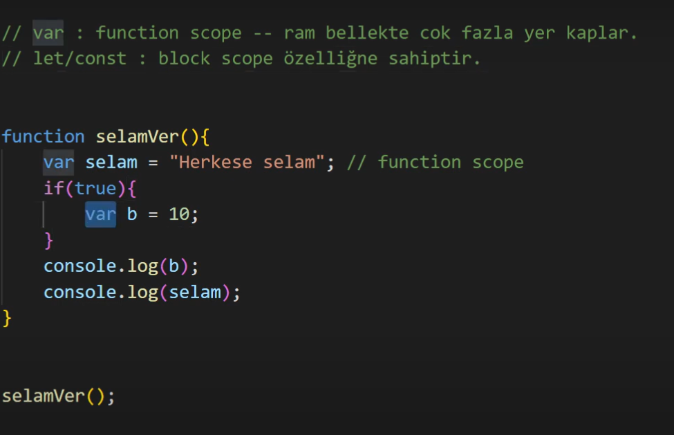
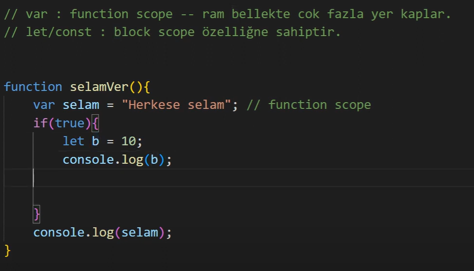
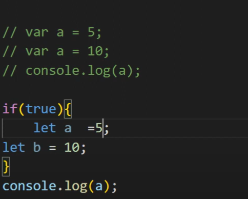
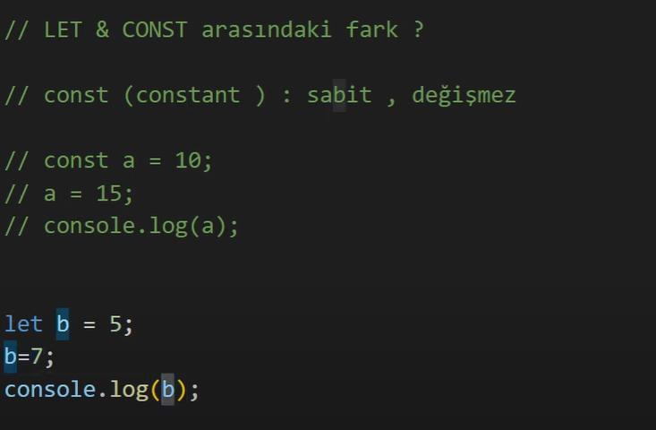

---SCOPE(kapsam)---

-- global scope 
-- function scope 
-- block scope

 -- var: erişilebilir.

 

 -- let: if kod blogu içerisinde yazınca erişilebilir. dışarıdan erişilemez.

 

 -- var ile aynı değişken ismınden yenı oluşturulabılır 5 10 olur fakat let ile aynı değişken isminden tekrar oluşturulamaz.

 ---

-- let ve const (constant - sabıt, değişmez) 

-- let değeri değişir consta değişmez.

##Ref

https://www.youtube.com/watch?v=mcwBvvThO40&list=PLURN6mxdcwL86Q8tCF1Ef6G6rN2jAg5Ht 

https://nodejs.org/en 

https://reactnative.dev/ onemli calismak icin

