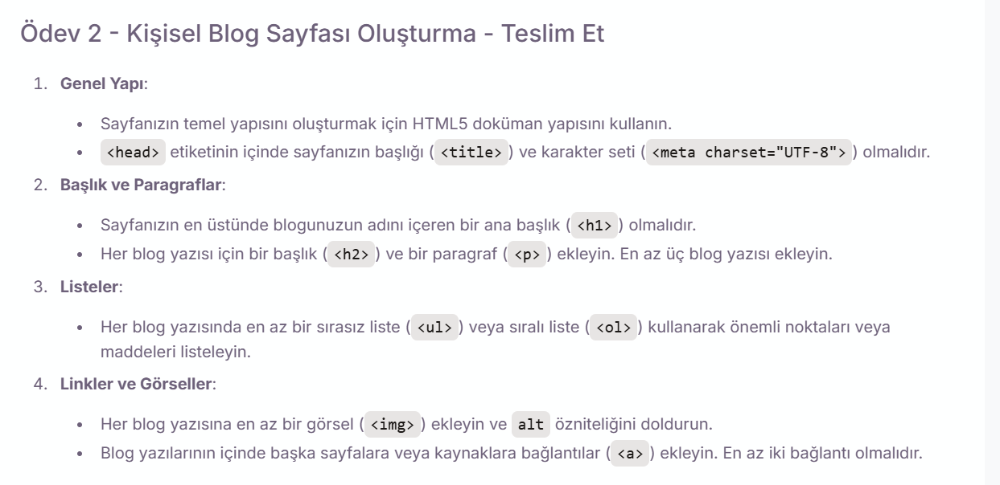

# Personal Blog Page Project

This project contains an HTML-based personal blog page that showcases multiple blog posts with structured formatting.

## Features

- **HTML5 Structure:**
  - Utilizes proper HTML5 document structure with `<html>`, `<head>`, `<body>`, `<title>`, and `<meta charset="UTF-8">`.
- **Headings & Paragraphs:**
  - The main heading (`<h1>`) displays the blog name.
  - Each blog post contains a subheading (`<h2>`) and at least one paragraph (`<p>`).
- **Lists:**
  - Each blog post includes either an ordered list (`<ol>`) or an unordered list (`<ul>`) for key points.
- **Images & Links:**
  - Each blog post features at least one image (``) with an appropriate `alt` attribute.
  - At least two links (`<a>`) direct to external sources or related blog pages.

## Installation

1. Clone this repository to your local machine:
   ```sh
   git clone https://github.com/selintas/PatikaFrontend.git
   ```
2. Open the `blog.html` file in a web browser to view and explore the blog page.

## Technologies Used

- HTML5
- CSS (for styling, if applied)

## Contribution

This is a practice project, but feel free to submit a pull request if you have improvements or suggestions.

## License

This project is free to use for educational purposes.

