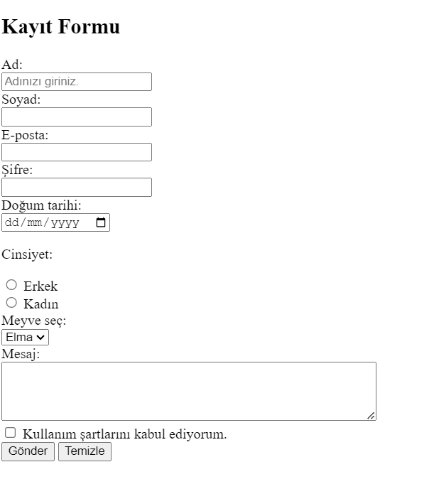

# Registration Form Project

This project contains an HTML registration form that collects user information through various input fields.

## Features

- **Text Inputs:**
  - First Name (`<input type="text">`)
  - Last Name (`<input type="text">`)
- **Email Input:**
  - Email field with validation (`<input type="email">`)
- **Password Input:**
  - Password field with a minimum length of 8 characters (`<input type="password">`)
- **Date Input:**
  - Date of Birth field (`<input type="date">`)
- **Radio Buttons:**
  - Gender selection (Male/Female) (`<input type="radio">`)
- **Checkbox:**
  - Terms and Conditions agreement (`<input type="checkbox">`)
- **Textarea:**
  - Message input field (`<textarea>`)
- **Dropdown Menu:**
  - Country selection (`<select>` with `<option>` elements)
- **Submit Button:**
  - Sends form data when clicked (`<input type="submit">`)

## Installation

1. Clone this repository to your local machine:
   ```sh
   git clone https://github.com/selintas/PatikaFrontend.git
   ```
2. Open the `form.html` file in a web browser to view and test the registration form.

## Technologies Used

- HTML5
- Basic CSS (if styling is added)

## Contribution

This is a practice project, but feel free to submit a pull request if you have improvements or suggestions.

## License

This project is free to use for educational purposes.
___

