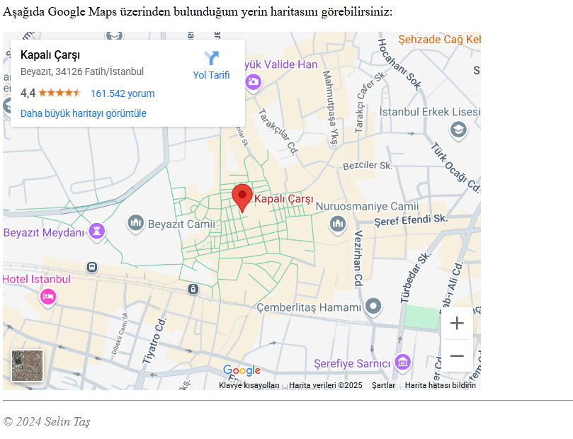

# My Personal Webpage (Kişisel Web Sayfam)


This project is a personal webpage assignment to introduce myself using HTML5.

## Task Description

In this task, an HTML file is created to display personal information in a structured and styled format.

## Features

- **HTML5 Structure:** Utilizes proper HTML5 document structure with `<html>`, `<head>`, `<body>`, `<title>`, and `<meta charset="UTF-8">`.
- **Headings & Paragraphs:**
  - The main heading (`<h1>`) contains my name.
  - Subheadings (`<h2>`, `<h3>`) organize sections like Resume, Education, Work Experience, Skills, and Contact.
  - Each section includes at least one paragraph for description.
- **Lists:**
  - Ordered list (`<ol>`) for education or work experience in chronological order.
  - Unordered list (`<ul>`) for listing skills or hobbies.
- **Images & Links:**
  - At least one image (``) with an appropriate `alt` attribute.
  - At least two links (`<a>`) to external pages (e.g., social media or portfolio projects).
- **iFrame Integration:**
  - An embedded webpage using `<iframe>`, such as a Google Maps location.
  - Custom `width` and `height` attributes to adjust the iframe size.
- **Styling:**
  - Background color or image.
  - Custom fonts and text colors.
  - Different styles for headings, paragraphs, and lists.
- **Layout & Organization:**
  - Content is divided into sections for clarity and readability.
  - `<div>` or `<section>` elements are used for structuring content.

## Installation

1. Clone this repository to your local machine:
   ```sh
   git clone https://github.com/selintas/PatikaFrontend.git
   ```
2. Open the HTML file in a web browser to view the personal webpage.

## Technologies Used

- HTML5
- CSS (for basic styling)

## Contribution

This is a practice project, but feel free to submit a pull request if you have improvements or suggestions.

## License

This project is free to use for educational purposes.
---
**iFrame Img:**
